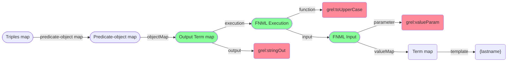

# FNML

```mermaid
graph LR
    T3M([Triples map])
    T3M-->|predicate-object map| POM([Predicate-object map])
    POM -->|objectMap| FM
    %% FM([Function Term map]):::fnml
    FM([Output Term map]):::fnml
    %% FM -->|function value| Ex([Triples map])
    FM -->|execution| Ex([FNML Execution]):::fnml
    %% FM -->|execution| Ex([Function Triples map]):::fnml
    %% FM -->|function value| Ex([Function Triples map]):::fnml
    FM -->|output| J(grel:stringOut):::fno
    Ex -->|function| Fn(grel:toUpperCase):::fno
    %% Ex -->|predicate-object map| ExPOM([Predicate-object map])
    %% ExPOM -->|predicate| ExP(fno:executes):::fno
    %% ExPOM -->|object map| ExO([Object map])
    %% ExO -->|constant| ExO1(grel:toUpperCase):::fno
    Ex -->|input| ParamPOM([FNML Input]):::fnml
    %% Ex -->|predicate-object map| ParamPOM([Predicate-object map])
    ParamPOM -->|parameter| P2(grel:valueParam):::fno
    ParamPOM -->|valueMap| O1(Term map)
    %% ParamPOM -->|predicate| P2(grel:str_value):::fno
    %% ParamPOM -->|object map| O1([Object map])
    O1 --> |template| Ot1("{lastname}"):::kfno
    %% ParamPOM -->|objectMap| ROM([ReferencingObjectMap])
    %% ROM -->|parentTriplesMap| PT3M([TriplesMap]):::ls2
    %% ROM -->|joinCondition| JC([JoinCondition])
    %% ROM -->|joinResultTerm| JTM("{parentsource_value}"):::ls2
    %% JC -->|childTerm| ChTM([TermMap]):::ls2
    %% JC -->|parentTerm| PaTM([TermMap]):::ls2
    classDef fnml fill:#8F9
    classDef fno fill:#F89
    classDef rml fill:#89F
    classDef ls2 fill:#09F
```
