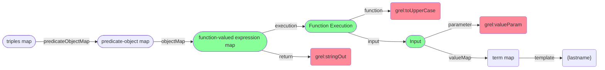

# FNML

```mermaid
graph LR
    T3M([triples map])
    T3M-->|predicateObjectMap| POM([predicate-object map])
    POM -->|objectMap| FM
    FM([function-valued expression map]):::fnml
    FM -->|execution| Ex([Function Execution]):::fnml
    FM -->|return| J(grel:stringOut):::fno
    Ex -->|function| Fn(grel:toUpperCase):::fno
    Ex -->|input| ParamPOM([Input]):::fnml
    ParamPOM -->|parameter| P2(grel:valueParam):::fno
    ParamPOM -->|valueMap| O1(term map)
    O1 --> |template| Ot1("{lastname}"):::kfno
    classDef fnml fill:#8F9
    classDef fno fill:#F89
    classDef rml fill:#89F
    classDef ls2 fill:#09F
```
